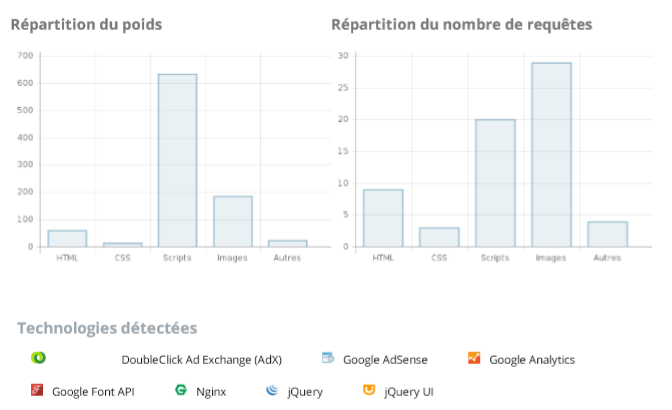

# **Audit de performance du site todolistme.net**

[1. Technologies externes](#technologies-externes)  
[2. Apperçu des performances](#apperçu-des-performances)  
[3. Audit du site](#audit-du-site)  
[4. Résumé](#résumé)  

****

## Technologies externes

L'utilisation de WhatsRun, nous a permis de pouvoir analyser les technologies utilisées par le site :  

 

  

 

**Request Map**

La request map de todolist.net nous permet d'observer l'ensemble des interactions avec les parties tiers.
Nous pouvons donc facilement constater d'ou viennent une majorité des soucis de chargement et de ralentissement du site. 

 

  

  

****

## Apperçu des performances

Plusieurs outils en ligne sont disponibles pour nous réaliser des audits et obtenir le condensé des informations nécessaire, ici nous avons utilisé Dareboost, en plus de l'inspecteur du navigateur Chrome et de Lighthouse.

**Temps d'affichage**

 

Tout d'abord nous allons nous intéresser au temps d'affichage, composante critique de l'expérience utilisateur et très bon indicateur de problèmes sous-jacents dans l'application.

 

Premier rapport (Dareboost):

 

  

 

Second rapport (LightHouse):

 

  

 

- Après observation de ces deux exemples nous constatons des différences, en particulier le début d'affichage, Dareboost se situe à 0.87sec alors que celui de LightHouse se situe à 1.6sec. Il est normal d'avoir des différences, y comprit en utilisant le même outil. Malgré ces différences, les deux sont d'accord sur un point : la fin de chargement est trop longue, 3.40 secs pour Dareboost et 5.4secs pour LightHouse. Une fois encore nous constatons des différences, mais même le meilleurs cas reste bien trop long pour une application relativement simple.

 

 

- Ici nous pouvons voir en partie d'ou vient ce temps de début d'affichage : les scripts et les images.

Dans la répartition du poids du ralentissement, le premier coupable est le script, il est clairement nécessaire de réduire sa taille et de l'optimiser autant que possible. Le second coupable est les images, il pourrait déjà etre utile de combiner les petites images dans une sprite CSS pour réduire le nombre de fichiers que le navigateur doit télécharger et donc accélèrer donc le chargement. On constate aussi que beaucoup d'images sont appelées par des requêtes externes, ce qui ralentis évidemment beaucoup le chargement du site. Si possible il vaudrait mieux les héberger dans le back-end afin de limiter les calls externes. Pour les images non externes, il faudrait étudier la possibilité de les compresser, ou de changer leur format vers quelque chose de plus léger et optimiser

Il serait aussi très utile d'utiliser un système de mise en cache des différentes images permettra de gagner encore plus de temps. 

 

 

- Dans ce tableau reprenant la répartition par domaines nous constatons plusieurs problèmes .

Premièrement, Jquery est bien trop lourd, plusieurs solutions sont possible : une mise à jour de Jquery -les version plus récentes sont bien plus performantes-, utiliser un fichier minifier -celui-ci étant moins lourd, le call sera plus rapide- ou utiliser du JavaScript ce qui éliminerait tout simplement le besoin de Jquery mais demanderait du temps de développemennt supplémentaire.

Deuxièmement, nous constatons qu'il y a beaucoup de calls externes dont l'utilité n'est pas assurée et qui ralentissent beaucoup le site pour un gain possiblement très faible. En particulier les calls automatiques vers les réseaux sociaux et tout les service Google. Si tout ces calls externes sont réellement essentiel, peut être pourrait-il être envisageable de déclencher certains d'entre eux grace a des évènements particulier et non systématiquement au chargement. Le mieux serait évidemment de réduire leur nombre.

 

Résumé des points à modifier pour améliorer la performance du site :

- Mettre à jour, minifier ou supprimer Jquery
- Optimiser le code JavaScript 
- Retravailler les images (réduire la taille, compresser, changer de format)
- Supprimer autant que possible les calls externes vers d'autres plateformes, ou au pire ne les déclencher que quand cela est nécessaire et non à chaque chargement.

  

****

## Audit du site

 

**Resumé**

 

Audit Lighthouse (extension Chrome) : 

 

 

Visiblement, des améliorations sont possibles ! 

 

**Performances**

 

 

- Le soucis des "render-blocking resources" est assez problématique et parfois inévitable. En effet, dans notre cas, ces ressources bloquantes concernent le style (fonts google, css, et jquery css). Evidemment, il est possible de faire que le render se produise même si ces ressources ne sont pas chargées, mais dans ce cas il est problable que l'utilisateur expérience une page sans aucun style (aussi appelé FOUC ou 'Flash of Unstyled Content') ce qui est bien sûr à éviter. Il est généralement préférable de ne pas avoir ce FOUC visible, dans ce cas, le mieux est d'optimiser au possible les styles afin que leur chargement se passe au plus vite (limite la taille et le nombre de fichier, réduire les calls sur des fonts externes ect).
- Le format des images n'est pas otpimisé, des format plus récents de que le png permettent une meilleure compression et un téléchargement plus rapide des images. 
- Des fonts externes sont utilisés, et dans le cas ou l'utilisateur n'a pas ces fonts, il devra les télécharger. Il est classique de définir des fonts de "fall-back" dans le cas ou le téléchargement est trop long ou s'il a été désactivé d'une manière ou d'une autre. Un font de call-back permet donc d'avoir le texte toujours visible, même pendant le téléchargement ou en cas d'échec de ce dernier.
- Aucun cache n'a été mis en place, en particulier pour les images. Cela pourrait éviter de les télécharger à chaque render et donc avoir un rendu plus rapide.
- Le code JS n'est pas optimisé, certains fonctions sont probablement beaucoup trop grosse et ralentissent beaucoup tout le rendu du site.
- Il y a trop chargements "critiques" (qui sont nécessaire pour le rendu), il faudrait en enlever autant que possible, réduire leur taille ou différer certains d'entre eux afin d'accélérer le chargement du site. (Utiliser la version minifiée de Jquery par exemple)

 

 

**Accessibilité**

 

 

Ensuite l'accessibilité laisse à désirer. Regarder l'audit plus en détail nous donne d'aurtes informations sur ce problème : 
- Le ratio de contrast en les couleurs en premier et second plan n'est pas assez élevé, c'est une mauvaise pratique, car un contraste trop faible peut rendre l'utilisation du site compliqué pour certains utilisateur (mal voyants, daltoniens ect), il est donc très important de régler ce problème. 
- Le résultat du test nous apprend aussi que certains Id ne sont pas uniques (en particulier dans des formulaires, tableaux ect), ce qui peut être problématique pour les bots en ligne par exemple, qui sauteront le 2nd id trouvé, seulement le premier sera "indexé". D'un point de vue code cela est aussi problématique et peut engendrer des dysfonctionnements.
- Il est aussi préférable d'attribuer un lang attribut au tag html, afin de référencer le langage principal utilisé.
- Nous constatons aussi que plusieurs images n'ont pas de alt attribut. Cet attribut permet par exemple d'aider à l'indexation dans les SEO (Search Engine Optimization), mais aussi de donner une description de l'image dans le cas ou celle-ci ne charge pas, ou encore pour les screen reader des non voyants. Même chose pour les formulaire et leur labels associés, ces labels ont le même intéret que les alt tags pour les images.

 

 

**Bonnes pratiques**

 

 

Plusieurs problèmes sont soulignés, certains très importants.
- Tout d'abord, le site n'utilise pas HTTPS et n'est donc pas sécurisé. La vie privée des utilisateurs n'est pas protégée, le site est particulièrement susceptible aux intrusions diverses, et HTTPS est de nos jours obligatoire pour une majorité des technologies récentes.
C'est une réelle faille de sécurité qui doit être corrigée.
- HTTP/2 est une version supérieur à HTTP/1.1, cependant, il faut utiliser HTTPS afin de pouvoir l'utilisée. L'utilisation d'HTTP/2 permet généralement un chargement des pages plu rapide.
- La version du Jquery utilisée est ancienne et contient des failles de sécurité connues, elle n'est pas minifiée vue la taille du call. Le site est donc une fois de plus particulièrement vulnérable.
- Plusieurs erreurs apparaissent dans la console, montrant que certaines requètes ont échouées, il serait préférable de corriger ces problèmes, mais la priorité n'est pas là.

La majorité des tests sont passés. En effet, on peut voir qu'il y a 75% des tests effectués qui sont validés.  
Les améliorations qui sont proposés par le site sont entre autre:
* Utiliser le cache du navigateur pour les fichiers qui sont long à charger (telle que les images),
* Enlever le CSS inutile,
* Utiliser des images au bon format et au bon poids.  

 

 

**SEO (Search Engine Optimization)**

 

 

Une fois encore, plusieurs problèmes sont mis en avant, en particulier pour le côté "mobile" de l'application.
- Pas de "viewport" metatag défini, par conséquent un utilisateur sur mobile aura une page adaptée pour desktop, ce qui évidemment n'est pas une bonne chose. Ce metatag permet donc d'adapter l'image entre les différentes t'ailles d'écran, sans même parler de responsive, cela permet au moins d'adapter correctement la page aux différents appareils et dimensions utilisés (ipad, ipadPro, les différentes tailles de mobiles mais aussi desktop).
- Certaines polices sont trop petites, en particulier sur mobile, on considère que pour lire ce qui est en dessous de 12px de font-size l'utilisateur est obligé de zoomer pour lire correctement, son expérience en est donc impactée.
- Et enfin les boutons et autres champs intéractibles sont aussi trop petits sur mobile.

 

 

**Application Web Progressive**

Notre concurrent n'a clairement pas mis en place une progressive web app, l'audit ne le traitant même pas.
Cela étant, une progresive pourrait apporter des avantages non négligeable dans l'optique de scale notre application : 
- Une PWA est compatible sur tout les mobiles.
- Coute beaucoup moins cher à développeur qu'une vraie application.
- Fonctionne en mode hors ligne, ce qui est aprticulièrement utile pour une Todo list.
- Charge même plus vite sur mobile que pc, les assets étant installés sur le téléphone.

 

 

****

## Résumé

 

Après cette étude du site de notre concurrent, nous pouvons mettre en avant plusieurs points de comparaison sur les choses à faire et à ne pas faire en cas de scaling de notre application. 

 

Cette liste est bien sûr non exhaustive, les améliorations possible étant "infinie" et dépendant des besoins du client. Elle représente cependant un bon guide des choses à prendre en compte en vue d'un scaling progressif visant à garder à jour un site aussi user friendly et sécurisé que possible.

 

 

**A faire**

 

- Mettre à jours régulièrement les librairies/packages
- Optimiser autant que possible le JS
- Utiliser un système de caching
- Améliorer l'accessibilité d'une manière générale (contraste, taille de police, tags)
- Améliorer l'utilisation mobile et le côté responsive
- Mettre en place la PWA

 

 

**A ne pas faire**

 

- Garder des failles de sécurité (HTTPS, corriger les vulnérabilités)
- Avoir trop de calls externe (fonts, publicités, librairies, réseaux sociaux) non essentiel
- Ne pas utiliser d'images non optimisées
- Faire appel à un trop grand nombre de ressources critiques chargées à chaque changement de page
