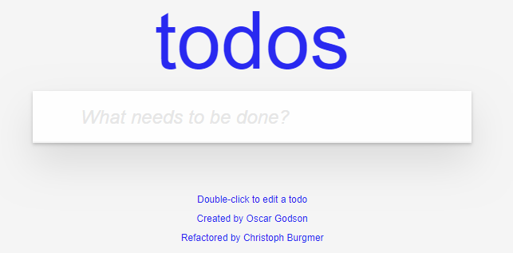
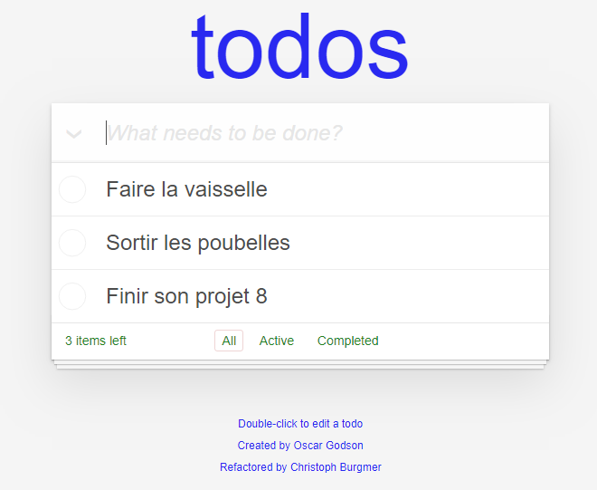
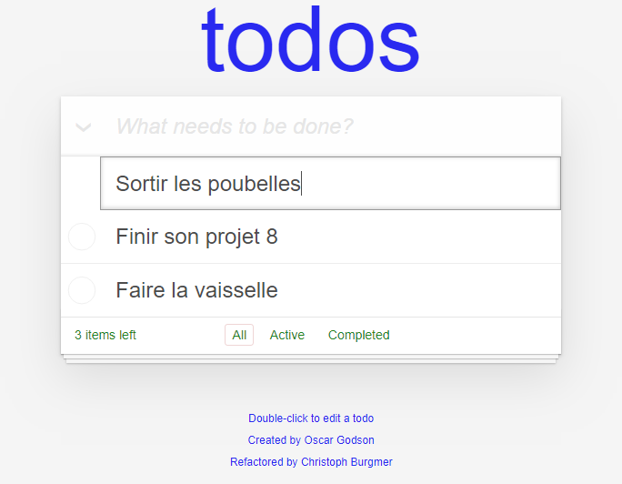
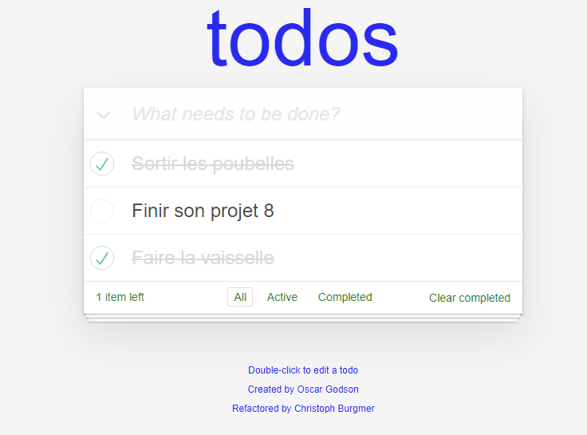
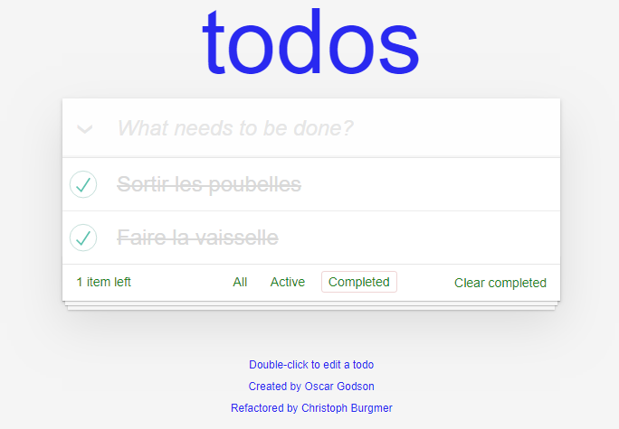
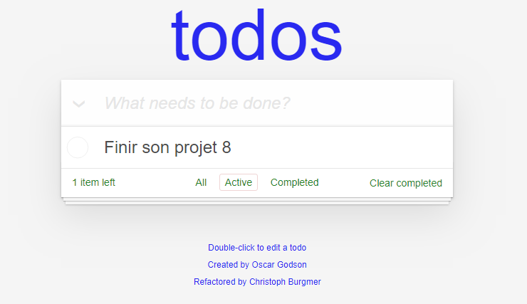
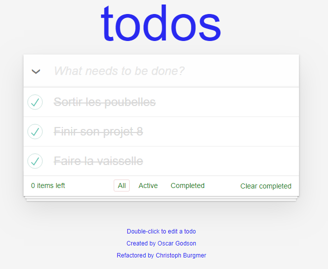
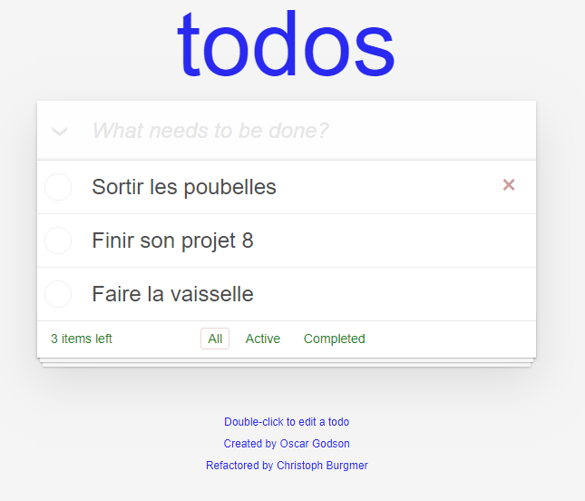

# **Guide d'utilisation du projet todolis**

[1. Installation](#installation)  
[2. Fonctionnalités](#fonctionnalités)  
[3. Fonctionnement interne](#fonctionnement-interne)  
[4. Audits comparatifs](#audit-comparatifs)  


L'application Todolist permet de créer et maintenir une liste de "todos", les marquer en tant que complet, et les filtrer. L'application est réalisée en Vanilla Javascript et n'a pas de dépendency, à part todomvc-common utilisé comme base (https://github.com/tastejs/todomvc-common).

Les tests sont réalisé à l'aide du standalone [Jasmine](https://jasmine.github.io/). Tout les tests peuvent être trouvés dans `/test/ControlloerSpec.js`. Pour utiliser les tests, vous devrez ouvrir `/test/SpecRunner.html` dans votre navigateur.

<br>

## Installation:

<br>

Téléchargez ou copiez ce projet sur votre ordinateur.

Cliquez sur le bouton "Clone or download" en haut à droite du projet. Puis cliquez sur l'icone "copy to clipboard". Enfin, ouvrez votre terminal et utilisez la commande git : 

`git clone https://github.com/PaulinViel/oc-projet8-todolist.git`

Vous pouvez aussi directement télécharger le fichier ZIP depuis le bouton "Download ZIP".

ici vous copiez le contenu du projet Github "oc-projet8-todolist" sur votre machine dans un dossier appelé comme le projet (oc-projet8-todolist).

Vous devriez pouvoir dès maintenant ouvrir le fichier `index.html` qui s'ouvrira dans votre navigateur et vous permettra d'utiliser l'application. Si jamais un problème se présente, il sera peut être nécessaire lancer `npm install` pour se mettre à jour. 

<br>

****

## Fonctionnalités: 

<br>

Cette application permet de gérer une liste de tâches (todo-list) sans devoir enregistrer de compte. Il est cenpendant nécessaire d'utiliser le même navigateur pour récupérer les données précédemment utilisées.

Il est possible de créer des todos, les éditer, les supprimer, les terminer, les réactiver et les filtrer par statut.

<br>

Nous allons voir dans le détail toutes les actions possible sur notre application :

<br>

### Page d'accueil

<br>

Voici la page d'accueil de l'application Todo. C'est une page très simple où l'on peut voir un champ texte (input) servant à ajouter de nouveaux todos.

<br>

  

<br>

### Création d'une liste

<br>

Ajouter un nouveau todo dans la liste est très simple. Il suffit d'écrire le titre du todo dans le champs texte ('What needs to be done?'), puis, soit appuyer sur la touche "Entrée", soit cliquer en dehors du champs sélectionné afin de valider l'entrée.

<br>

  

<br>

### Modifier un todo

<br>

Pour modifier un todo, double-cliquez sur son titre, vous passerez en mode "édition", le todo sélectionné aura une bordure grise et votre curseur se trouvera dans le champs de titre, comme vu ci-dessous. A partir de là vous pouvez modifier le titre de votre todo en validant de la même façon que vu précédemment ("Entrée" ou "Click" en dehors du champs). Dans le cas ou vous souhaiteriez  annuler votre modification avant d'avoir validation, appuyer sur "Echap", l'ancien titre sera restauré. 

<br>

  

<br>

### Terminer un todo

<br>

Pour terminer un todo (le marquer complété), il suffit de cliquer sur l'icône à gauche du titre de celui-ci, représenté par un cercle gris. Si vous avez cliqué au bon endroit, la bordure du cercle deviendra plus foncée, une flèche verte apparaîtra au centre de ce dernier, et le titre du todo complété sera barré et rendu plus clair. Vous pouvez annulé la complétion d'un todo en cliquant une fois de plus sur le cercle. 

<br>

  

<br>

Cliquer sur le lien "Completed" se situant en bas de la fenêtre, entre "Active" et "Clear completed" (quand celui-ci est visible) permet d'aller sur une page montrant tout les todos marqués comme complétés.
Lorsqu'un ou plusieurs todo sont complétés, un lien "Clear completed" apparait en bas à droite de la fenêtre. Cliquer sur ce lien supprimera tout les todos marqués comme "complétés" de toutes les pages ("All", "Completed") et ce de manière manière définitive.

<br>

  

<br>

Cliquer sur le lien "Active", situé entre "All" et "Completed", permet de voir tout vos todos actifs (non marqués comme "complété")

<br>

  

<br>

### Complétion de tout les todos

<br>

Cliquer sur la flèche se situant à gauche du champs d'ajout de titre de todo "What needs to be done?" permet de marqué tout les todos comme marqués, que ceux-ci soient déjà marqués ou non. 

<br>

  

<br>

### Supprimer un todo 

<br>

Il y a deux façons de supprimer un/des todos.

Si le/les todos ont été marqués comme "complétés", cliquer sur "Clear completed" les supprimera définitivement.
Dans le cas ou vous souhaiteriez supprimer un seul todo, complété ou non, vous pouvez cliquer sur la croix marron qui apparaît au survol d'un todo. Cette action supprimera définitivement le todo et il ne sera pas récupérable, il est préférable de ne supprimer des todos avec cette fonction qu'en cas d'erreur.

<br>

  

<br>

## Fonctionnement interne: 

<br>

### Vue d'ensemble

<br>

L'arborescence suivante présente l'architecture des dossiers principaux du projet.
```
|
│ index.html
│
├─── js
│       app.js
│       controller.js
│       helpers.js
│       model.js
│       store.js
│       template.js
│       view.js
│
├─── node_modules
│
└─── test
        ControllerSpec.js
        SpecRunner.html
```

Le dossier js contient le cœur même de l'application. Ce sont ces fichiers qui permettent de gérer entièrement la todo-list dans le fichier index.html .

Si vous lancez npm install, le dossier node_modules contiendra le framework de test unitaire Jasmine ainsi que la base de Todomvc-common.

Le dossier test contient les fameux tests unitaires qui utilise Jasmine.

L’application est organisée selon une architecture MVC (Modèle - Vue - Contrôleur) basée sur Todomvc (https://github.com/tastejs/todomvc-common).

 <br>
 
#### MVC
L’objectif de ce pattern est de séparer la logique du code en trois parties distinctes :
• Model: Il s'occupe de la data, créer, mettre à jour, supprimer ect (dans notre application, c'est le store.js qui enrigistre la data elle-même dans le local storage et le model.js comminque avec le store.js)
• View: Elle a accès au DOM et est utilisée pour mettre en place les event handlers tel que les "clicks" c'est aussi elle qui met en place l'HTML en communiquant avec notre template.js. 
• Controller: C'est la glue entre le model et la view, il s'occupe des changements causés par l'utilisateur et envoie l'information au model.js ou à la view.js (voir aux deux) afin de mettre à jour l'application.

#### App.js
Initialisation de l'application, création de la base de données, du controller, etc... Il gère aussi la mise à jour de la view au chargement de la page ou à chaque changement d'url.

- Todo() : met en place la todo-list "todos-vaillajs" qui sera stockée dans le LocalStorage du navigateur. Elle crée une instance du model qui permettra d'intéragir avec les données. Le template html de base d'un todo est définit ici, et la view par défaut est attachée à ce template. (dans ce projet, la view ne contient pas de HTML, tout est dans le template.js) Le controller fait alors le lien entre le model et la view.
- setView() : gère le chargement de la view en fonction de l'url actuelle. Cette fonction est appelée au chargement de la page, mais également lorsque le hashtag de l'url change ("All", "Active", "Completed").

#### store.js
Ce fichier va créer une nouvel objet base de données qui sera stockée dans le LocalStorage du navigateur. Ces méthodes ne sont appelées que dans le fichier model.js (Comme vu précédemment, il n'ya a que le controller qui intéragit avec la data).

- Store : Créé une nouvelle instance de la base de données dans le LocalStorage du navigateur, si elle n'existe pas déjà.
- Store.prototype.find : Récupère un item dans la base de données.
- Store.prototype.findAll : Récupère tous les items de la base de données.
- Store.prototype.save : Ajoute (s'il nexiste pas) ou met à jour (s'il existe) un item dans la base de données.
- Store.prototype.remove : Supprime un item de la base de données.
- Store.prototype.drop : Clear complétement la base de données.

#### template.js
Dans un modèle MVC classique, c'est la view qui s'occupe du code HTML, ici, cette fonctionnalité est déléguée au template et la view appelle les méthodes nécéssaires en fonction des actions utilisateur.

- Template : Génère un template par défaut.
- Template.prototype.show : Récupère le template par défaut et y injecte les informations du todo.
- Template.prototype.itemCounter : S'occupe de l'affichage du nombre de todos.
- Template.prototype.clearCompletedButton : S'occupe de l'affichage du bouton "Clear completed".

#### helpers.js
Ce fichier permet principalement de ne pas utiliser de librairie lourde comme Jquery. Les actions nécessaire dans notre application étant plutôt simple et légère, il est plus rapide et performant de les créer nous-même. Il permet donc de créer des fonctions réutilisables pour toutes les intéractions nécessaires.

- qs : querySelector, récupère le premier élément html d'après un sélecteur à l'intérieur d'un autre élement (scope).
- qsa : querySelectorAll, récupères tous les éléments html d'après un sélecteur à l'intérieur d'un autre élement (scope).
- $on : Ajoute un event listener à l'élément choisi.
- $delegate : Créer un gestionnaire d'évènements sur un élément existant ou sur un futur élément.
- $parent : Permet de récupérer le parent d'un élément html.

#### model.js
Initialise le model et gère la data dans la base de donnée (dans le localStorage). 

- Model : Génère un nouveau model.
- Model.prototype.create : Créé un nouveau todo.
- Model.prototype.read : Recupère un ou plusieurs éléments dans la base de données.
- Model.prototype.update : Met à jour un élément.
- Model.prototype.remove : Supprime un élément.
- Model.prototype.removeAll : Supprime tous les éléments.
- Model.prototype.getCount : Compte le nombre d'éléments existants dans la base de données.

#### view.js
Gère l'affichage. Les fonctions récupèrent les données reçuent (depuis model.js via controller.js) et les affichent en utilisant le template défini dans template.js, c'est donc lui qui met à jour le visuel de l'application.

- View : Définit le template à utiliser et prépare les éléments à cibler via les class CSS.
- View.prototype._removeItem : Supprime un todo.
- View.prototype._clearCompletedButton : Affiche ou cache le bouton "Clear completed".
- View.prototype._setFilter : "Active" visuellement le bouton de filtre sélectionné ("All", "Completed", "Active").
- View.prototype._elementComplete : Change le visuel d'un todo en fonction de son statut ("Completed" ou non).
- View.prototype._editItem : Gère l'affichage lors de la modification d'un todo.
- View.prototype._editItemDone : Retourne à l'affichage classic du todo qui vient d'être modifié.

<br>

View.prototype.render : S'occupe des fonctions suivantes : 
 - showEntries : Affiche les todos.
 - removeItem : Supprime un todo.
 - updateElementCount : Met à jour le nombre de todos.
 - clearCompletedButton : Mets à jour le bouton Clear completed.
 - contentBlockVisibility : Affiche ou masque le "footer" de la todo-list.
 - toggleAll : Marque tous les éléments comme "Completed".
 - setFilter : Gère l'affichage des filtres (url).
 - clearNewTodo : Vide le champ texte principal de la todo-list après création.
 - elementComplete : Gère l'affichage pour l'ajout d'un nouveau todo.
 - editItem : Gère l'affichage d'un todo en cours de modification.
 - editItemDone : Gère l'affichage d'un todo dont la modification vient d'être terminée.
 - View.prototype._itemId : Récupère l'ID d'un todo.
 - View.prototype._bindItemEditDone : Gère l'affichage lors de la perte de focus du todo en cours d'édition.
 - View.prototype._bindItemEditCancel : Gère l'affichage du todo dont la modification est annulée.
 - View.prototype.bind : Attache un gestionnaire d'évènement, avec des évènements javascript associées qui permettront d'effectuer le rendu.

#### controller.js
Met en relation model.s et view.js en réaction aux input de l'utilisateur. Lors d'une action, le controller notifie model.js pour mettre à jour la base de données, et view.js pour mettre à jour le visuel.

- Controller : Crée le lien entre le model et la view.
- Controller.prototype.setView : Initialise la vue.
- Controller.prototype.showAll : Affiche tous les todos.
- Controller.prototype.showActive : Affiche les todos actifs.
- Controller.prototype.showCompleted : Affiche les todos complétés.
- Controller.prototype.addItem : Ajoute un todo.
- Controller.prototype.editItem : Modifie un todo.
- Controller.prototype.editItemSave : Enregistre la modification d'un todo.
- Controller.prototype.editItemCancel : Annule la modification d'un todo.
- Controller.prototype.removeItem : Supprime un todo.
- Controller.prototype.removeCompletedItems : Supprime tous les todos complétés.
- Controller.prototype.toggleComplete : Coche ou décoche un todo.
- Controller.prototype.toggleAll : Coche ou décoche tous les todos.
- Controller.prototype._updateCount : Met à jour le nombre de todos.
- Controller.prototype._filter : Filtre les todos selon leur statut.
- Controller.prototype._updateFilterState : Mets à jour le statut coché selon l'url.

****

## Audits comparatifs: 

****

<br>

  

<br>
<br>

  

<br>
